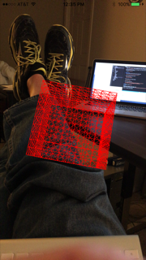

#ezAR Cube Demo
This app renders a rotating 3D cube over a video preview. The cube is managed using 
[three.js](http://threejs.org/). The ezAR VideoOverlay plugin provides the vide preview.  
  
*At this time the demo works best on iOS devices. Your mileage will vary on Android devices based on the 
graphics capabilities of the device.* 
  



##Getting Started
1. Install the ezAR Video Overlay plugin using the [Cordova SDK CLI](https://cordova.apache.org/)
```
    cordova plugin add <path>/com.ezartech.ezar.videooverlay
```
2. Install the platforms you plan to test on.   
```
    cordova platform add ios
    cordova platform add android
```    

3. Build the project for all installed platforms  
```
    cordova build --device
```
4. Install on your device and run  
  
    *I use [GapDebug](https://www.genuitec.com/products/gapdebug/) for drag-n-drop  
    app installation and when needed debugging of my Cordova web UIs.*
  
##License
See [modified MIT license](LICENSE).  
  
##Credits
The project code was adapted from Ajeet Yadev's article 
[Creating 3D Cube: A Practical Guide to Three.js](http://www.awwwards.com/creating-3d-cube-a-practical-guide-to-three-js-with-live-demo.html)  
  
Copyright (c) 2015-2016, ezAR Technologies